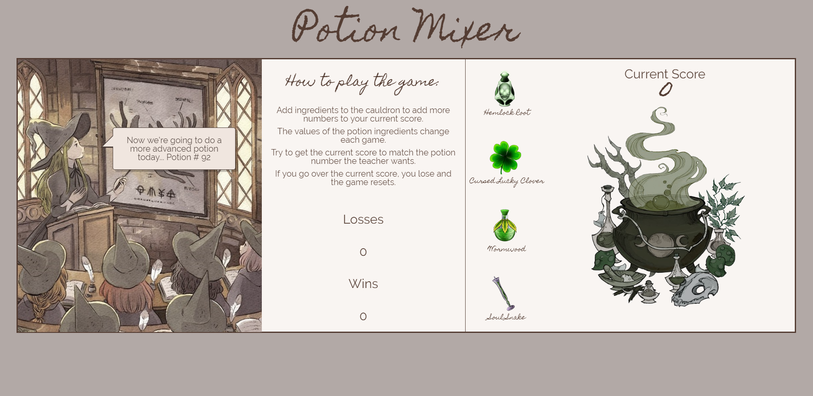
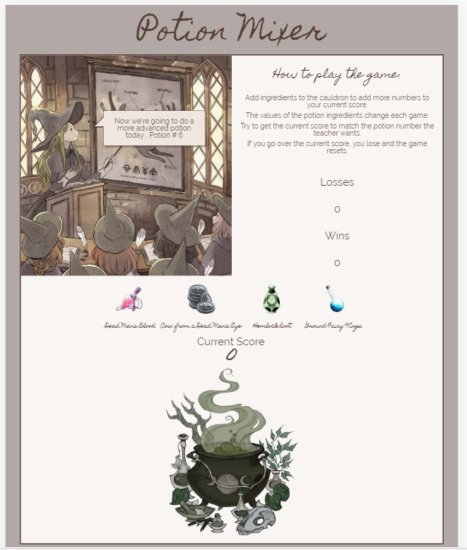
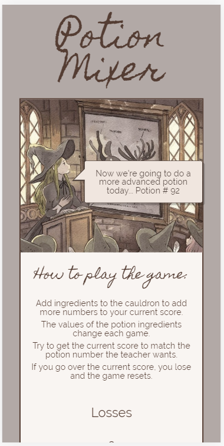

# unit-4-game - Potion Mixer
A game where you try to fill your cauldron with ingredients to match the value of potion the teacher wants.

[Play the Game Here!](https://typicu.github.io/unit-4-game/)

## Author
Madeleine Griggs.

## About this Project
this is a number guessing game, where you guess the value of the various ingredients to try and match the value of the potion number given by the teacher. It was developed as part of the UofT coding bootcamp. It is written in Javascript, JQuery, HTML, and CSS. This was my first major delve into JQuery.

## Information about the Theme

### Colors Used
-  `#b2a9a6 - Medium Mushroom: Used for the main background.`
-  `#f9f5f2 - Light Cream: Used for the game container background.`
-  `#543D33 - Dark Mushroom: Used for the text and borders.`
-  `#F5E5D9 -  Cream: Used for the teacher's speech bubble background.`

### Fonts Used
- Font Family: 'Homemade Apple', cursive. Used for title text, subtitle text, ingredient games, current score counter.
- Font Family: 'Raleway', sans-serif. Used for all other text.

### Images Used
- I found the images for the ingredients as part of a larger fantasy game icons pack, found here: [Open Game Art](https://opengameart.org/content/game-icons-of-fantasy-potions-pack-1)
- Other Art: [Link to the Cauldron image](https://www.kisspng.com/png-witchcraft-the-arts-drawing-illustration-witch-dec-429420/)

### Screenshots

#### Large Screens

#### Medium Screens

#### Small Screens
